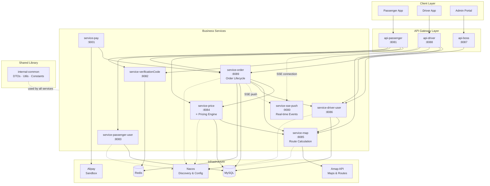

# FlyTaxi — Microservices Ride-Hailing Platform

[](https://github.com/Ninika369/Fly_Taxi/actions/workflows/ci.yml)

A backend ride-hailing platform built with **Java / Spring Boot / Spring Cloud** microservices architecture. Features real-time driver-passenger matching via SSE, dynamic pricing with versioned rules, and integrated payment processing.

> **Security note:** Environment-variable-based configuration has been introduced for the currently CI-tested modules (`service-price` and `service-order`). Some other modules still use local sandbox/default values and are being externalized before container/cloud deployment.

---

## Tech Stack

**Backend:** Java 8, Spring Boot 2.4, Spring Cloud, MyBatis-Plus, OpenFeign

**Infrastructure:** MySQL, Redis, Nacos (service discovery & config)

**API Edge:** api-passenger, api-driver, api-boss (Spring Boot gateway modules with JWT authentication)

**APIs & Integration:** Amap (Gaode Maps) API, Alipay Sandbox, Server-Sent Events (SSE)

**Engineering:** JUnit 5, Mockito, GitHub Actions CI, OpenAPI/Swagger (springdoc)

---

## System Architecture

The platform follows a layered microservices architecture with 11 independently deployable modules and 1 shared common library:



**Key data flows:**
- **Price prediction:** Client → api-passenger → service-price → service-map (Amap distance/duration) → calculatePrice() → Client
- **Order lifecycle:** Create → Dispatch → Accept → Depart → Arrive → Pick up → Drop off → Payment
- **Real-time updates:** Order status changes push to passengers/drivers via SSE (Server-Sent Events)

---

## Modules

| Module | Port | Description |
|--------|------|-------------|
| `api-passenger` | 8081 | Passenger-facing API gateway — ride booking, price prediction, payments |
| `api-driver` | 8088 | Driver-facing API gateway — order acceptance, location upload, payment requests |
| `api-boss` | 8087 | Admin API gateway — driver/vehicle management, user administration |
| `service-price` | 8084 | **Dynamic pricing engine** — fare prediction, rule versioning, price calculation |
| `service-order` | 8089 | **Order lifecycle management** — state machine, cancellation logic, time-based penalties |
| `service-map` | 8085 | Map integration — route calculation, distance/duration via Amap API |
| `service-driver-user` | 8086 | Driver registration, credential verification, vehicle binding |
| `service-passenger-user` | 8083 | Passenger registration and profile management |
| `service-verificationCode` | 8082 | OTP generation and validation via Redis TTL |
| `service-pay` | 9001 | Alipay sandbox payment integration |
| `service-sse-push` | 9000 | Real-time event push to clients via Server-Sent Events |
| `internal-common` | — | Shared library — DTOs, utilities, constants (no web server) |

---

## Engineering Practices

### Test Automation — 48 CI-verified unit tests across 4 test classes

The CI pipeline currently runs 48 pure unit tests (no Spring context, no database) across `internal-common`, `service-price`, and `service-order`, using **JUnit 5** and **Mockito**.

Several auto-generated Spring context smoke tests still exist in other modules and are currently excluded from CI because they require live infrastructure.

| Test Class | Module | Tests | What It Covers |
|-----------|--------|-------|----------------|
| `BigDecimalUtilsTest` | internal-common | 11 | Arithmetic precision — add, subtract, multiply, divide, edge cases (zero, negative, divide-by-zero) |
| `PredictPriceServiceTest` | service-price | 13 | Pricing formula — normal trips, short trips, traffic jams, rounding boundaries (995m/1004m/1005m), duration staircase, regression tests for .005 precision fix |
| `PriceRuleServiceTest` | service-price | 8 | Rule versioning — create, edit with change detection, duplicate rejection, fareType composition, version auto-increment |
| `OrderInfoServiceTest` | service-order | 16 | Order cancellation state machine — 5 passenger states, 4 driver states, time boundary (1m59s free vs 2m0s penalty), Mockito verify() for DB writes |

### Precision Bug Discovery & Fix

During testing, we discovered a **half-cent rounding bug** in the pricing calculation:

**Root cause:** `new BigDecimal(double)` introduces binary floating-point error. For example, `new BigDecimal(1.005)` is internally stored as `1.00499999...`, causing `setScale(2, ROUND_HALF_UP)` to round *down* to `1.00` instead of *up* to `1.01`.

**Process:** Wrote characterization tests to document the bug → confirmed the behavior → fixed with `BigDecimal.valueOf(result)` → tightened tests into regression tests to prevent recurrence.

**Commit:** `fix: resolve .005 precision bug using BigDecimal.valueOf`

### CI/CD — GitHub Actions

Every push to `master` triggers automated testing:

1. **Build** — `mvn clean install -DskipTests` (compile all 12 modules)
2. **Test** — `mvn test -pl internal-common,service-price,service-order` (run 48 targeted unit tests)

CI is intentionally scoped to the 3 modules with substantive unit tests. Several auto-generated Spring context smoke tests in other modules are not part of the pipeline because they depend on live infrastructure such as MySQL, Redis, or Nacos.

### API Documentation — OpenAPI / Swagger

Interactive API documentation is available for the pricing service:

- **Swagger UI:** `http://localhost:8084/swagger-ui.html` (when service-price is running)
- **OpenAPI spec:** `http://localhost:8084/v3/api-docs`

All 7 endpoints in service-price are documented with `@Operation` summaries, `@Parameter` descriptions, and `@Schema` annotations on DTOs with example values.

### Security — Secrets Externalization

Hardcoded credentials in CI-tested modules have been replaced with environment variable placeholders:

```yaml
# Example: service-price/application.yml
password: ${DB_PASSWORD:sunhaoxian}    # reads from env var, falls back to dev default
```

This applies to database passwords, Nacos credentials, and third-party API keys in `service-price` and `service-order`. Remaining modules are scheduled for externalization before container/cloud deployment.

---

## If you're reviewing the code, start here

- [`PredictPriceService.java`](service-price/src/main/java/com/george/serviceprice/service/PredictPriceService.java) — core pricing logic with BigDecimal precision fix
- [`PredictPriceServiceTest.java`](service-price/src/test/java/com/george/serviceprice/service/PredictPriceServiceTest.java) — 13 tests including rounding boundary and regression tests
- [`OrderInfoServiceTest.java`](service-order/src/test/java/com/george/serviceorder/service/OrderInfoServiceTest.java) — 16 tests covering cancellation state machine with Mockito
- [`.github/workflows/ci.yml`](.github/workflows/ci.yml) — CI pipeline configuration

---

## Getting Started

### Prerequisites
- Java 8+
- Maven 3.6+
- MySQL 5.7+
- Redis
- Nacos 2.x

### Installation

```bash
# Clone the repository
git clone https://github.com/Ninika369/Fly_Taxi.git
cd Fly_Taxi

# Build all modules
mvn clean install -DskipTests

# Run unit tests (no MySQL/Redis/Nacos required)
mvn test -pl internal-common,service-price,service-order
```

### Running the Services

1. Start MySQL and create databases: `service-price`, `service-order`, `service-driver-user`, `service-map`, `service-passenger-user`
2. Start Redis on default port (6379)
3. Start Nacos in standalone mode
4. Launch services individually via IDE or `mvn spring-boot:run` in each module directory

---

## Known Limitations & Roadmap

### Known Issues (documented with tests)
- **Intermediate rounding:** `BigDecimalUtils.divide()` rounds to 2 decimal places at each step, causing 995m–1004m to all resolve as 1.00km. Characterization tests are in place; fix planned to defer rounding to the final calculation step.
- **Cancel threshold readability:** `ChronoUnit.MINUTES.between() > 1` effectively means ≥ 2 minutes due to truncation. Semantically clearer as `>= 2`.
- **Variable naming:** `distanceMiles` / `startMile` should be `distanceKm` / `startKm` to reflect actual units.
- **No input validation:** Negative distance or duration values are silently accepted, producing incorrect prices.

### Roadmap
- [ ] Externalize remaining sandbox secrets and JWT signing key
- [ ] Add request validation (`@Valid` / `@Positive`) for pricing endpoints
- [ ] Docker Compose for one-command local startup
- [ ] Single-service cloud deployment (service-price on free PaaS)
- [ ] Actuator /health endpoint for observability
- [ ] React thin demo — pricing page + SSE real-time visualization
- [ ] Strategy Pattern refactor for payment/map provider abstraction

---

## License

This project was built as a portfolio project for educational and demonstration purposes.