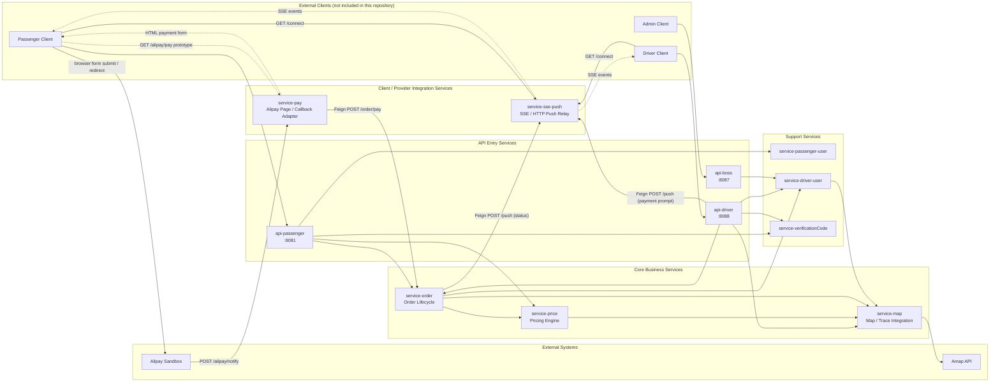
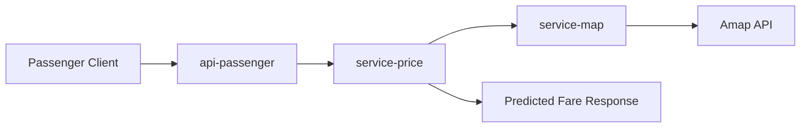
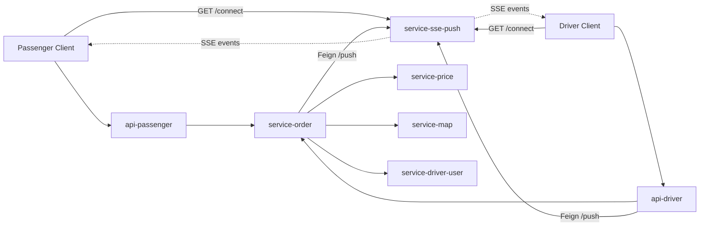

# FlyTaxi — Microservices Ride-Hailing Platform

[](https://github.com/Ninika369/Fly_Taxi/actions/workflows/ci.yml)

A backend ride-hailing platform built with **Java 8 / Spring Boot 2.4.13 / Spring Cloud 2020.0.1** microservices. It implements driver dispatch and order-state workflows, versioned fare rules, SSE-based status delivery, and an Alipay sandbox adapter. The repository contains backend services; the passenger, driver, and admin clients are not included.

> **Security note:** Committed configuration is mostly environment-backed for datasource, Nacos, Amap, and Alipay settings. Redis is environment-backed in `api-passenger` and `service-order`; `api-driver` still uses Spring Boot Redis defaults. `JWT_SECRET` is supported, but a deterministic legacy fallback remains. See Configuration Externalization Status and Selected Known Issues for details.

---

## Tech Stack

**Backend:** Java 8 (verified CI baseline), Spring Boot 2.4.13, Spring Cloud 2020.0.1, Spring Cloud Alibaba 2021.1, MyBatis-Plus, OpenFeign

**Infrastructure:** MySQL 8.0.30 (audited database target), Redis + Redisson (distributed locks), Nacos (service discovery; server version not pinned by the repository)

**API entry services:** `api-passenger`, `api-driver`, `api-boss`

**Direct client/provider ingress:** `service-sse-push` (SSE connect/close) and `service-pay` (direct Alipay sandbox prototype + provider callback)

**APIs & Integration:** Amap (Gaode Maps) API, Alipay Sandbox, Server-Sent Events (SSE)

**Engineering:** JUnit 5, Mockito, GitHub Actions CI, OpenAPI/Swagger via springdoc (`service-price` only)

---

## System Architecture

The platform follows a layered microservices architecture with 11 Spring Boot application modules and 3 shared libraries (14 child modules; 15 Maven projects including the root aggregator):


```mermaid
flowchart LR
    subgraph Clients["External Clients (not included in this repository)"]
        P["Passenger Client"]
        D["Driver Client"]
        A["Admin Client"]
    end
    subgraph API["API Entry Services"]
        AP["api-passenger<br/>:8081"]
        AD["api-driver<br/>:8088"]
        AB["api-boss<br/>:8087"]
    end
    subgraph Core["Core Business Services"]
        O["service-order<br/>Order Lifecycle"]
        PR["service-price<br/>Pricing Engine"]
        M["service-map<br/>Map / Trace Integration"]
    end
    subgraph Integration["Client / Provider Integration Services"]
        EV["service-sse-push<br/>SSE / HTTP Push Relay"]
        PAY["service-pay<br/>Alipay Page / Callback Adapter"]
    end
    subgraph Support["Support Services"]
        PU["service-passenger-user"]
        DU["service-driver-user"]
        VC["service-verificationCode"]
    end
    subgraph External["External Systems"]
        AM["Amap API"]
        AL["Alipay Sandbox"]
    end
    P --> AP
    D --> AD
    A --> AB
    P -- "GET /connect" --> EV
    D -- "GET /connect" --> EV
    P -. "GET /alipay/pay prototype" .-> PAY
    EV -. "SSE events" .-> P
    EV -. "SSE events" .-> D
    PAY -. "HTML payment form" .-> P
    P -- "browser form submit / redirect" --> AL
    AP --> O
    AP --> PR
    AP --> PU
    AP --> VC
    AD --> O
    AD --> DU
    AD --> M
    AD --> VC
    AD -- "Feign POST /push (payment prompt)" --> EV
    AB --> DU
    PR --> M
    O --> PR
    O --> M
    O --> DU
    O -- "Feign POST /push (status)" --> EV
    DU --> M
    PAY -- "Feign POST /order/pay" --> O
    M --> AM
    AL -- "POST /alipay/notify" --> PAY
```

- Dispatch and driver matching happen in `service-order` using map and driver data.
- Browsers connect directly to `service-sse-push`; backend push callers use Feign.
- `driver-test.html` and `passenger-test.html` are local SSE demo assets, not production passenger/driver frontends.
- The direct `/alipay/pay` path is a sandbox prototype ingress; protected passenger payment entry and edge authorization remain planned.

**Shared platform notes:**
- All Spring Boot modules register with **Nacos** for service discovery.
- `internal-common` is a shared library for DTOs, constants, and utility classes used by all 11 Spring Boot application modules; `security-support-core` and `security-support-session` are intentionally independent.
- `security-support-core` remains a framework-neutral skeleton for principal models, verification contracts, failure semantics, and test fixtures. It is not yet wired into existing applications.
- `security-support-session` is a dependency-light skeleton for session validation, Bearer extraction, principal creation after session validation, and HTTP error mapping. It has no Spring Web or Redis adapter implementation yet and is not wired into existing applications.
- MySQL-backed services include `service-price`, `service-order`, `service-driver-user`, `service-passenger-user`, and `service-map`.
- Redis is used in `api-passenger`, `api-driver`, and `service-order` for token/code storage, blacklist checks, and coordination-related runtime state. `api-driver` currently uses Boot Redis defaults because it lacks `spring.redis` configuration.

**Key runtime flow — Price prediction:**

```mermaid
flowchart LR
    Client["Passenger Client"] --> AP["api-passenger"]
    AP --> PR["service-price"]
    PR --> M["service-map"]
    M --> AM["Amap API"]
    PR --> Fare["Predicted Fare Response"]
```

**Key runtime flow — Order lifecycle + SSE:**

```mermaid
flowchart LR
    Passenger["Passenger Client"] --> AP["api-passenger"]
    Driver["Driver Client"] --> AD["api-driver"]
    Passenger -- "GET /connect" --> EV["service-sse-push"]
    Driver -- "GET /connect" --> EV
    AP --> O["service-order"]
    AD --> O
    O --> PR["service-price"]
    O --> M["service-map"]
    O --> DU["service-driver-user"]
    O -- "Feign /push" --> EV
    AD -- "Feign /push" --> EV
    EV -. "SSE events" .-> Passenger
    EV -. "SSE events" .-> Driver
```

---

## Modules

| Module | Port | Description |
|--------|------|-------------|
| `api-passenger` | 8081 | Passenger edge — verification-code login/registration prototype (SMS delivery not integrated), token refresh, profile lookup, ride booking/cancellation, price prediction |
| `api-driver` | 8088 | Driver edge — verification-code login prototype (SMS delivery not integrated), driver/work-status operations, order-state updates, location upload, payment prompts |
| `api-boss` | 8087 | Admin edge — driver, vehicle, and binding management; authentication/RBAC/audit planned |
| `service-price` | 8084 | **Dynamic pricing engine** — fare prediction, rule versioning, price calculation |
| `service-order` | 8080 framework default; intended 8089 / 8090 overrides use legacy profile syntax | **Order lifecycle management** — dispatch and order lifecycle, cancellation, finalization/recovery |
| `service-map` | 8085 | Map integration — route, trace, point, and district integration through Amap |
| `service-driver-user` | 8086 | Driver/vehicle records, availability/work status, and bindings |
| `service-passenger-user` | 8083 | Passenger registration and profile lookup |
| `service-verificationCode` | 8082 | Random verification code generation, used by passenger and driver APIs |
| `service-pay` | 9001 | Alipay sandbox payment-page/callback adapter; protected passenger-edge entry planned |
| `service-sse-push` | 9000 | Client-facing SSE connect/close endpoints plus an HTTP push relay; subject/service authorization and lifecycle hardening planned |
| `internal-common` | — | Shared library — DTOs, utilities, constants (no web server) |
| `security-support-core` | — | Shared security library — framework-neutral principal models, verification contracts, and failure semantics (no web server; consumer migration not yet started) |
| `security-support-session` | — | Shared security library — session-validation and HTTP-adaptation contracts built on core (no web server; no Spring Web/Redis adapter yet; consumer migration not started) |

---

## Engineering Practices

### Test Automation — 167 CI-verified tests across 25 test classes

The CI pipeline runs root-level `mvn test` across the full set of 14 child modules plus the root aggregator. The repository currently has 167 CI-verified tests: 157 unit-style tests and 10 lightweight HTTP contract tests. None require a full Spring application context or external MySQL, Redis, or Nacos infrastructure. MockMvc verifies the server-side controller contract, while WireMock exercises OpenFeign client HTTP methods, paths, query and path parameters, JSON bodies, content types, and response decoding. These tests currently live in `internal-common`, `api-passenger`, `service-price`, `service-order`, `service-map`, `security-support-core`, and `security-support-session`; modules without test classes still participate in the reactor and will automatically be covered as tests are added later.

| Test Class | Module | Tests | What It Covers |
|-----------|--------|-------|----------------|
| `BigDecimalUtilsTest` | internal-common | 11 | Arithmetic precision — add, subtract, multiply, divide, edge cases (zero, negative, divide-by-zero) |
| `OrderInfoSerializationTest` | internal-common | 1 | Jackson serialization keeps normal order fields visible while hiding internal finalization recovery metadata from client-facing `OrderInfo` JSON |
| `PredictPriceServiceTest` | service-price | 18 | Pricing formula — normal trips, short trips, traffic jams, cross-hour duration, rounding boundaries (995m/1004m/1005m), duration staircase, input validation for invalid distance/duration/null inputs, regression tests for .005 precision fix |
| `PriceRuleServiceTest` | service-price | 8 | Rule versioning — create, edit with change detection, duplicate rejection, fareType composition, version auto-increment |
| `OrderInfoServiceTest` | service-order | 75 | Order cancellation state machine, explicit finalization-state fencing for legacy lifecycle/payment/cancel writers, predecessor-state CAS and CAS-miss reread behavior, audited timestamp preservation for wrapper-based transitions, durable passenger get-off finalization, bounded finalization retry states, completion-time retry backoff, terminal CAS transitions, expired max-attempt lease handling, controlled failed-finalization recovery including legacy failed rows after retry-limit configuration changes, finalization numeric guards for malformed track and price data, finalization lease/deadline policy validation, dedicated finalization client isolation, READ-02 SQL/benchmark and ADR guardrails, null-retry-time due-scan consistency, sanitized dependency exception handling, idempotent completed-order handling, trace-search UTC window, dispatch lock safety, invalid candidate handling, exhausted dispatch semantics, track-search failure propagation, and pre-insert downstream failure propagation — 5 passenger states, 4 driver states, fixed-Clock passenger and driver cancellation matrix at 59/60/119/120 seconds, Mockito verify() for DB writes, CAS claims, retry metadata, and lock release |
| `OrderFinalizationRetryJobTest` | service-order | 1 | Scheduled finalization recovery path continues processing due orders after one truly unexpected retry exception |
| `PriceRuleControllerContractTest` | service-price | 2 | MockMvc server contracts for `POST /price-rule/is-latest` and `POST /price-rule/if-exists` — JSON request mapping, response schema, service delegation, and GET rejection |
| `ServicePriceClientContractTest` | service-order | 4 | WireMock/OpenFeign client contracts for `POST /price-rule/is-latest`, `POST /price-rule/if-exists`, and `POST /calculate-price` — declared metadata, method, path, content type, JSON body or query parameters, and response decoding |
| `ServiceMapClientContractTest` | service-order | 1 | WireMock/OpenFeign client contract for `POST /terminal/trsearch` — method, path, query parameters, and generic trace-response decoding |
| `ServiceDriverUserClientContractTest` | service-order | 1 | WireMock/OpenFeign client contract for `GET /get-available-driver/{carId}` — method, path variable, and generic driver-response decoding |
| `FinalizationFeignClientContractTest` | service-order | 7 | Finalization-only OpenFeign contracts and configuration isolation — dedicated context IDs, copied shared-client method contracts, client-specific timeout property shape, driver/map/price WireMock requests, and response decoding |
| `TerminalClientTest` | service-map | 9 | Amap track adapter duration units and malformed or empty track handling — aggregate track milliseconds first, convert once to seconds with fractional-segment coverage, preserve distance in meters, treat positive-count empty tracks as a stable map failure, and reject missing, negative, or overflowing provider values |
| `PassengerPredictPriceServiceTest` | api-passenger | 1 | Passenger-edge price prediction preserves downstream service failure code and message instead of rewrapping as success |
| `MapServiceClientTest` | service-map | 1 | Amap direction adapter surfaces invalid provider JSON as an exception instead of returning null |
| `DirectionServiceTest` | service-map | 1 | Direction service converts map adapter failure into a stable map-direction domain failure |
| `DictDistrictServiceTest` | service-map | 1 | District initialization returns map failure on provider status failure and skips database writes |
| `PredictPriceFlowServiceTest` | service-price | 1 | Price prediction flow preserves map-service failure before pricing rule lookup |
| `RequestPrincipalTest` | security-support-core | 3 | Shared-principal value semantics, refresh-token rejection, and framework-neutral field-type guard |
| `TokenClaimsTest` | security-support-core | 3 | Typed claim invariants, required text validation, and strict timestamp ordering |
| `SecurityFailureCodeTest` | security-support-core | 2 | Stable authentication-versus-authorization failure classification |
| `TokenVerificationResultTest` | security-support-core | 4 | Session-validation handoff, service-token independence, result invariants, and failure access rules |
| `SessionValidationResultTest` | security-support-session | 3 | Session validation success/failure invariants and invalid factory rejection |
| `SessionPrincipalFactoryTest` | security-support-session | 3 | Core-to-session handoff, access-principal creation, and invalid session/non-access rejection |
| `BearerTokenExtractorTest` | security-support-session | 3 | Case-insensitive Bearer extraction and malformed, missing, or whitespace-containing credential rejection |
| `SecurityHttpErrorMapperTest` | security-support-session | 3 | Stable 401/403/503 translation for core, session, and missing-credential failures |

### Precision Bug Discovery & Fix

During testing, we discovered a **half-cent rounding bug** in the pricing calculation:

**Root cause:** `new BigDecimal(double)` introduces binary floating-point error. For example, `new BigDecimal(1.005)` is internally stored as `1.00499999...`, causing `setScale(2, ROUND_HALF_UP)` to round *down* to `1.00` instead of *up* to `1.01`.

**Process:** Wrote characterization tests to document the bug, confirmed the behavior, fixed with `BigDecimal.valueOf(result)`, and tightened tests into regression tests to prevent recurrence.

**Commit:** `fix: resolve .005 precision bug using BigDecimal.valueOf`

### CI/CD — GitHub Actions

Every pull request targeting `master` and every push to `master` triggers automated testing:

1. **Build** — `mvn clean install -DskipTests` (build and install the 15-project Maven reactor)
2. **Test** — `mvn test` (run root-level tests across the 14 child modules and the root aggregator)

The 167 tests currently include 157 unit-style tests and 10 lightweight contract tests in `internal-common`, `api-passenger`, `service-price`, `service-order`, `service-map`, `security-support-core`, and `security-support-session`. The remaining modules do not have test classes yet; they still participate in the Maven reactor and will be included automatically as tests are added later. Integration tests against live infrastructure such as MySQL, Redis, and Nacos remain future work.

### Database Change Management

Database changes are tracked under [`database/`](database/). ORDER-04 adds planned artifacts for durable order finalization metadata:

- [migration](database/migrations/ORDER-04__add_order_finalization_metadata.sql)
- [rollback](database/rollback/ORDER-04__add_order_finalization_metadata.sql)
- [verification](database/verification/ORDER-04__add_order_finalization_metadata.sql)
- [benchmark evidence plan](database/benchmark/ORDER-04__add_order_finalization_metadata.md)

READ-02 adds reviewed artifacts for normalizing historical completed-order `drive_time` values to seconds while keeping the physical column name:

- [migration](database/migrations/READ-02__normalize_order_drive_time_seconds.sql)
- [rollback](database/rollback/READ-02__normalize_order_drive_time_seconds.sql)
- [verification](database/verification/READ-02__normalize_order_drive_time_seconds.sql)
- [benchmark evidence plan](database/benchmark/READ-02__normalize_order_drive_time_seconds.md)

These artifacts are not automatically executed by the application or CI. They document reviewed database changes, rollback paths, read-only checks, the ORDER-04 due-scan benchmark plan, the READ-02 normalization benchmark plan, and write-path cost considerations for MySQL 8.0.30. The ORDER-04 benchmark now models the nullable due-scan predicate and distinguishes the one existing indexed status column, two new indexed retry columns, and two new non-indexed metadata columns. The administrator HTTP recovery endpoint remains deferred until authenticated ADMIN identity, RBAC, and audit support are in place; the scheduled recovery path uses the internal service method only.

Rollout order matters: ensure ORDER-04 is applied and verified before starting the current finalization-aware `service-order` code against MySQL. The current finalization-aware code treats statuses 6, 7, and 8 as idempotently completed, so the verification checks must confirm those historical completed rows already have `drive_mile`, `drive_time`, and `price`. If that query is non-zero, stop rollout and clean test data or follow an explicit data-coordination plan; the rollout process does not automatically guess or rewrite historical orders.

Rollback has a manual state gate. Stop finalization traffic and the order-finalization retry scheduler, run the pre-rollback verification, and continue only when status 10 and 11 rows are zero. Do not automatically map those rows back to status 5, 6, or another state. Once the gate is clear, deploy the previous `service-order` code while temporarily retaining the extra columns, then run the ORDER-04 schema rollback and post-rollback verification.

READ-02 must be run only after the operator sets the actual deployment cutover of the seconds-based `drive_time` implementation and reviewed candidate ceiling in the same MySQL session. The cutover uses the same database wall-clock semantics as `passenger_getoff_time`, must not be in the future, and must not be guessed from Git history. It converts only completed pre-cutover rows and records an audit table to prevent double conversion. A zero-candidate run requires explicit operator acknowledgement, and non-zero candidates must not exceed `@read02_max_candidate_rows`. READ-02 verifies the actual `drive_time` column is a signed BIGINT before using BIGINT capacity, rejects NULL or negative historical duration inputs, and uses NULL-safe current/audit comparisons. A same-cutover rerun is valid only when every target row matches its audit record. The audited schema has `order_info.gmt_create` and `order_info.gmt_modified` with `ON UPDATE CURRENT_TIMESTAMP`, so the READ-02 update explicitly self-assigns both columns to preserve their original values; `migrated_at` is written only to the audit table. READ-02 does not modify either timestamp column DDL or the physical `drive_time` column definition because the repository does not yet include a complete schema baseline. Global `gmt_create` / `gmt_modified` DDL governance remains planned under the database-governance roadmap (DB-07B). The conversion multiplies historical minute values by 60, producing minute-granularity lower-bound seconds; zero historical minute values are legal and cannot be treated as double-conversion evidence. If READ-02 verification finds ambiguous historical rows, stop rollout and clean test data or follow an explicit data-coordination plan. Disposable synthetic databases may instead be reset or reseeded.

Order finalization retry policy is configurable through `ORDER_FINALIZATION_*` environment variables. Startup validation requires the processing lease to be greater than the sum of the dedicated driver, map, and price remote-call timeout budget plus the configured safety margin. The dedicated finalization OpenFeign clients are isolated by context ID so these timeouts do not change order creation or dispatch behavior.

Finalization states 10 and 11 are explicitly fenced from legacy lifecycle, payment, and cancellation writers. The legacy `toPickUpPassenger`, `arrivedDeparture`, `pickUpPassenger`, `pushPayInfo`, and `pay` paths use predecessor-state CAS transitions, while `cancel()` returns a stable finalization-in-progress result for status 10/11 without writing. Because the audited schema has `ON UPDATE CURRENT_TIMESTAMP` on both `gmt_create` and `gmt_modified`, wrapper-based order transitions explicitly preserve `gmt_create`; legacy CAS also preserves `gmt_modified`, while finalization transitions keep writing their deliberate event time. Internal finalization attempt, retry-time, error, and trace-window metadata is hidden from ordinary `OrderInfo` JSON responses.

### API Documentation — OpenAPI / Swagger

Interactive API documentation is available for the pricing service:

- **Swagger UI:** `http://localhost:8084/swagger-ui.html` (when service-price is running)
- **OpenAPI spec:** `http://localhost:8084/v3/api-docs`

All seven service-price controller methods have `@Operation` metadata. The actual-price query parameters use `@Parameter` descriptions, and request DTOs use `@Schema` descriptions and examples.

### Configuration Externalization Status

Committed configuration now uses environment-variable placeholders for many local runtime values, but a few legacy defaults remain.

**Environment-backed:**
- DB credentials/URLs for MySQL services
- Nacos
- Amap / Alipay
- `api-passenger` and `service-order` Redis
- order-finalization policy/timeouts

**Known gaps:**
- `api-driver` Redis uses `localhost:6379` / database `0` defaults because it has the Redis starter but no `spring.redis` block.
- `JWT_SECRET` is supported, but a deterministic development fallback remains when `JWT_SECRET` is absent.

`.env.example` is an inventory of expected variable names. Spring Boot does not automatically load it; export those variables in your shell, IDE run configuration, or deployment environment.

```yaml
# Example: service-price/application.yml
password: ${DB_PASSWORD:}
```

---

## If you're reviewing the code, start here

- [`PredictPriceService.java`](service-price/src/main/java/com/george/serviceprice/service/PredictPriceService.java) — core pricing logic with BigDecimal precision fix
- [`PredictPriceServiceTest.java`](service-price/src/test/java/com/george/serviceprice/service/PredictPriceServiceTest.java) — 18 tests including rounding boundary, input validation, cross-hour duration, and regression tests
- [`OrderInfoSerializationTest.java`](internal-common/src/test/java/com/george/internalCommon/dto/OrderInfoSerializationTest.java) — 1 test covering client-facing JSON exclusion for internal order-finalization recovery metadata
- [`OrderInfoServiceTest.java`](service-order/src/test/java/com/george/serviceorder/service/OrderInfoServiceTest.java) — 75 tests covering cancellation state machine, explicit finalization-state fencing for legacy lifecycle/payment/cancel writers, predecessor-state CAS and CAS-miss reread behavior, audited timestamp preservation for wrapper-based transitions, passenger and driver fixed-Clock cancellation boundaries at 59/60/119/120 seconds, durable passenger get-off finalization, bounded retry, completion-time retry backoff, terminal CAS transitions, expired max-attempt lease handling, controlled failed-finalization recovery including legacy failed rows after retry-limit configuration changes, finalization numeric guards, finalization lease/deadline policy validation, dedicated finalization client isolation, READ-02 SQL/benchmark and ADR guardrails, null-retry-time due-scan consistency, sanitized dependency exception handling, idempotent completed-order handling, fixed trace-search end time, invalid candidate handling, exhausted dispatch semantics, track-search failure propagation, pre-insert downstream failure propagation, and dispatch lock safety with Mockito
- [`OrderFinalizationRetryJobTest.java`](service-order/src/test/java/com/george/serviceorder/job/OrderFinalizationRetryJobTest.java) — 1 test covering scheduled finalization recovery isolation when one retry fails with a truly unexpected exception
- [`ServicePriceClientContractTest.java`](service-order/src/test/java/com/george/serviceorder/remote/ServicePriceClientContractTest.java) — 4 tests covering price-rule and actual-price OpenFeign contracts with WireMock
- [`ServiceMapClientContractTest.java`](service-order/src/test/java/com/george/serviceorder/remote/ServiceMapClientContractTest.java) — 1 test covering the trace-search OpenFeign contract with WireMock
- [`ServiceDriverUserClientContractTest.java`](service-order/src/test/java/com/george/serviceorder/remote/ServiceDriverUserClientContractTest.java) — 1 test covering the available-driver OpenFeign contract with WireMock
- [`FinalizationFeignClientContractTest.java`](service-order/src/test/java/com/george/serviceorder/remote/FinalizationFeignClientContractTest.java) — 7 tests covering dedicated finalization OpenFeign context IDs, copied shared-client method contracts, timeout property-shape isolation, and driver/map/price WireMock requests
- [`PassengerPredictPriceServiceTest.java`](api-passenger/src/test/java/com/george/apipassenger/service/PassengerPredictPriceServiceTest.java) — 1 test covering passenger-edge downstream failure propagation
- [`PredictPriceFlowServiceTest.java`](service-price/src/test/java/com/george/serviceprice/service/PredictPriceFlowServiceTest.java) — 1 test covering map-service failure propagation before price-rule lookup
- [`MapServiceClientTest.java`](service-map/src/test/java/com/george/servicemap/remote/MapServiceClientTest.java) — 1 test covering Amap direction parse failure surfacing
- [`DirectionServiceTest.java`](service-map/src/test/java/com/george/servicemap/service/DirectionServiceTest.java) — 1 test covering map adapter failure translation
- [`DictDistrictServiceTest.java`](service-map/src/test/java/com/george/servicemap/service/DictDistrictServiceTest.java) — 1 test covering Amap district status failure handling
- [`TerminalClientTest.java`](service-map/src/test/java/com/george/servicemap/remote/TerminalClientTest.java) — 9 tests covering Amap track duration conversion from milliseconds to seconds, fractional-segment aggregation before truncation, positive-count empty-track domain failure, and malformed, negative, or overflowing provider values
- [`docs/adr/0004-finalization-recovery-policy-and-deadline.md`](docs/adr/0004-finalization-recovery-policy-and-deadline.md) — controlled failed-finalization recovery and lease/deadline policy
- [`database/README.md`](database/README.md) — database change-management and runtime bootstrap boundaries
- [`service-sse-push/src/main/java/com/george/servicessepush/controller/SseController.java`](service-sse-push/src/main/java/com/george/servicessepush/controller/SseController.java) — current client-facing SSE connection, push relay, and known trust/lifecycle gaps
- [`.github/workflows/ci.yml`](.github/workflows/ci.yml) — CI pipeline configuration

---

## Getting Started

### Prerequisites
- JDK 8 (Temurin 8 verified CI baseline)
- Maven (version not pinned by the repository; CI uses runner-provided Maven)
- MySQL 8.0.30 (audited baseline)
- Redis
- Nacos server (version not pinned by the repository)

### Installation

```bash
# Clone the repository
git clone https://github.com/Ninika369/Fly_Taxi.git
cd Fly_Taxi

# Build all modules
mvn clean install -DskipTests

# Run all repository tests (unit-style and lightweight contract tests, no infrastructure needed)
mvn test

# Optional local shortcut: run only the current test-bearing modules
mvn test \
  -pl internal-common,api-passenger,service-price,service-order,service-map,security-support-core,security-support-session
```

### Running the Services

> **Runtime reproducibility boundary:** Builds and tests are reproducible without infrastructure. Full service startup is not reproducible from an empty database because the repository does not yet contain a complete schema/seed baseline. ORDER-04 and READ-02 are reviewed change artifacts, not bootstrap migrations.

0. Use `.env.example` as a checklist, then export variables manually or inject them through your IDE/deployment environment. The file is not auto-loaded by Spring Boot.
1. Provision compatible MySQL 8.0.30 databases for `service-price`, `service-order`, `service-driver-user`, `service-map`, and `service-passenger-user` from an existing or reviewed schema baseline.
2. Ensure ORDER-04 is applied and verified before the current finalization-aware `service-order` starts.
3. Run READ-02 only when retained pre-A2 historical completed-order data still stores `drive_time` in minutes and the reviewed preconditions are satisfied.
4. Start Redis. `api-driver` currently expects the Spring Boot defaults: `localhost:6379`, database `0`.
5. Start Nacos.
6. Provide Amap and Alipay credentials before exercising map or payment flows.
7. Launch each service from its `*Application` main class in your IDE.

`service-order` currently contains intended 8089 and 8090 port overrides using the legacy `spring.profiles` document key. Migration to `spring.config.activate.on-profile` and startup verification are planned in Batch E. Until that work lands, treat 8080 as the unprofiled Spring Boot default and the two profile ports as configured intentions rather than verified runtime behavior.

---

## Selected Known Issues

This is a selected, non-exhaustive list. Authentication/authorization, payment, SSE, and database-integrity hardening are the next planned workstreams.

- **Admin authorization:** `api-boss` admin writes currently lack app-layer authentication, RBAC, and audit enforcement.
- **Legacy edge authorization:** passenger and driver JWT interceptors exist, but typed principal migration, strict role isolation, and object ownership checks are planned.
- **JWT fallback:** `JWT_SECRET` can be supplied through the environment, but a deterministic development fallback remains when `JWT_SECRET` is absent; production fail-closed configuration is planned.
- **api-driver Redis defaults:** `api-driver` includes Redis support but lacks a `spring.redis` block, so it uses `localhost:6379` / database `0`.
- **Verification delivery:** verification codes are generated and stored in Redis, but no SMS-provider delivery integration is currently implemented.
- **Legacy profile configuration:** the intended `service-order` 8089/8090 port overrides still use the legacy `spring.profiles` document syntax; migration and startup verification are planned in Batch E.
- **SSE trust and lifecycle:** `service-sse-push` exposes `/connect`, `/push`, and `/close` without subject/service authorization and stores emitters in a static `HashMap` without completion, timeout, or error lifecycle cleanup.
- **Payment ownership:** server-owned amount, ownership validation, strict callback order/status correlation, failure acknowledgement, and idempotency are still planned. The protected passenger-edge payment route is not implemented yet.
- **Bootstrap gap:** the repository does not yet include a complete empty-database schema or one-command full-stack runtime bootstrap.
- **Intermediate rounding:** `BigDecimalUtils.divide()` rounds to 2 decimal places at each step, causing 995m–1004m to all resolve as 1.00km. Characterization tests are in place; fix planned to defer rounding to the final calculation step.
- **Cancel threshold readability:** behavior is deterministically characterized as free before 120 seconds and penalty at/after 120 seconds; production expression readability remains deferred.
- **Variable naming:** `distanceMiles` / `startMile` should be `distanceKm` / `startKm` to reflect actual units.

### Roadmap

#### Hardening roadmap
- [ ] Batch B — Authentication & authorization: typed principal, passenger/driver role isolation, object authorization, ADMIN bootstrap/RBAC/audit, service identity, protected failed-finalization recovery endpoint
- [ ] Batch C — Payment & SSE trust boundaries: server-owned payment facts, callback order/status correlation and idempotency, authenticated SSE subject/service binding and lifecycle cleanup
- [ ] Batch D — Database and order consistency: preflight/cleanup, unique/FK/NOT NULL constraints, active-order/active-binding invariants, conditional assignment/idempotency/outbox
- [ ] Batch E — Runtime engineering: operational profiles, local bootstrap, observability, and deployment hygiene
- [ ] **Batch F — Modernization:** Lombok/JDK compatibility prerequisite, Java 21, Spring Boot 3.5, Spring Cloud 2025, and dependency/module cleanup

#### Portfolio / delivery roadmap
- [ ] Add request validation (`@Valid` / `@Positive`) for pricing endpoints
- [ ] Replace blocking dispatch retry (`Thread.sleep`) with an async scheduler or delayed queue
- [ ] Docker Compose for one-command local startup
- [ ] Integrate an SMS provider for passenger/driver verification-code delivery
- [ ] Single-service cloud deployment (service-price on free PaaS)
- [ ] Actuator /health endpoint for observability
- [ ] React thin demo — pricing page + SSE real-time visualization
- [ ] Strategy Pattern refactor for payment/map provider abstraction

---

## Project Status

This repository is a portfolio and educational demonstration project. It is not production-ready; the security, database-baseline, deployment, and modernization work above remains in progress.

No open-source license file is currently included.
