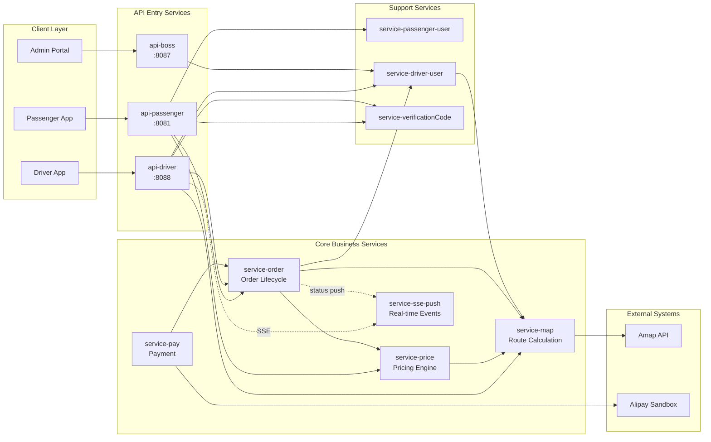
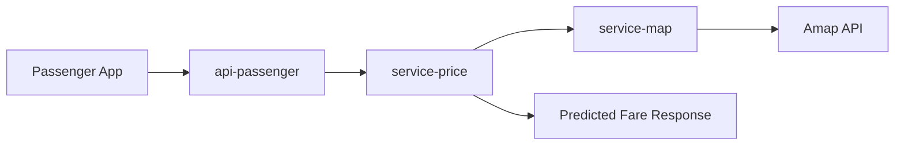
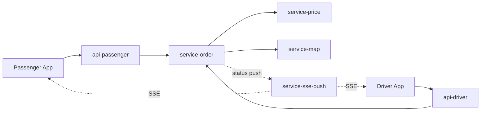

# FlyTaxi — Microservices Ride-Hailing Platform

[](https://github.com/Ninika369/Fly_Taxi/actions/workflows/ci.yml)

A backend ride-hailing platform built with **Java / Spring Boot / Spring Cloud** microservices architecture. Features real-time driver-passenger matching via SSE, dynamic pricing with versioned rules, and integrated payment processing.

> **Security note:** Committed configuration uses environment-variable placeholders for datasource, Nacos, Redis, JWT, Amap, and Alipay settings. Local runtime values should be supplied through environment variables; see `.env.example`.

---

## Tech Stack

**Backend:** Java 8, Spring Boot 2.4, Spring Cloud, MyBatis-Plus, OpenFeign

**Infrastructure:** MySQL, Redis + Redisson (distributed locks), Nacos (service discovery)

**API Edge:** api-passenger, api-driver, api-boss (Spring Boot API entry modules with JWT authentication)

**APIs & Integration:** Amap (Gaode Maps) API, Alipay Sandbox, Server-Sent Events (SSE)

**Engineering:** JUnit 5, Mockito, GitHub Actions CI, OpenAPI/Swagger (springdoc)

---

## System Architecture

The platform follows a layered microservices architecture with 11 independently deployable Spring Boot applications and 2 shared libraries in a 13-module Maven reactor:


```mermaid
flowchart LR
    subgraph Clients["Client Layer"]
        P[Passenger App]
        D[Driver App]
        A[Admin Portal]
    end
    subgraph API["API Entry Services"]
        AP[api-passenger<br/>:8081]
        AD[api-driver<br/>:8088]
        AB[api-boss<br/>:8087]
    end
    subgraph Core["Core Business Services"]
        O[service-order<br/>Order Lifecycle]
        PR[service-price<br/>Pricing Engine]
        M[service-map<br/>Route Calculation]
        EV[service-sse-push<br/>Real-time Events]
        PAY[service-pay<br/>Payment]
    end
    subgraph Support["Support Services"]
        PU[service-passenger-user]
        DU[service-driver-user]
        VC[service-verificationCode]
    end
    subgraph External["External Systems"]
        AM[Amap API]
        AL[Alipay Sandbox]
    end
    P --> AP
    D --> AD
    A --> AB
    AP --> O
    AP --> PR
    AP --> PU
    AP --> VC
    AD --> O
    AD --> DU
    AD --> M
    AD --> VC
    AD -. SSE .-> EV
    AB --> DU
    PR --> M
    O --> PR
    O --> M
    O --> DU
    O -. status push .-> EV
    DU --> M
    PAY --> O
    M --> AM
    PAY --> AL
```

**Shared platform notes:**
- All Spring Boot modules register with **Nacos** for service discovery.
- `internal-common` is a shared library used across all modules for DTOs, constants, and utility classes.
- `security-support-core` is a framework-neutral shared library containing the new principal models, verification contracts, failure semantics, and test fixtures. It is a skeleton in this PR and is not yet wired into existing applications.
- MySQL-backed services include `service-price`, `service-order`, `service-driver-user`, `service-passenger-user`, and `service-map`.
- Redis is used in `api-passenger`, `api-driver`, and `service-order` for token/code storage, blacklist checks, and coordination-related runtime state.

**Key runtime flow — Price prediction:**

```mermaid
flowchart LR
    Client[Passenger App] --> AP[api-passenger]
    AP --> PR[service-price]
    PR --> M[service-map]
    M --> AM[Amap API]
    PR --> Fare[Predicted Fare Response]
```

**Key runtime flow — Order lifecycle + SSE:**

```mermaid
flowchart LR
    Passenger[Passenger App] --> AP[api-passenger]
    Driver[Driver App] --> AD[api-driver]
    AP --> O[service-order]
    AD --> O
    O --> PR[service-price]
    O --> M[service-map]
    O -. status push .-> EV[service-sse-push]
    EV -. SSE .-> Passenger
    EV -. SSE .-> Driver
```
---

## Modules

| Module | Port | Description |
|--------|------|-------------|
| `api-passenger` | 8081 | Passenger-facing API gateway — ride booking, price prediction, payments |
| `api-driver` | 8088 | Driver-facing API gateway — order acceptance, location upload, payment requests |
| `api-boss` | 8087 | Admin API gateway — driver/vehicle management, user administration |
| `service-price` | 8084 | **Dynamic pricing engine** — fare prediction, rule versioning, price calculation |
| `service-order` | 8089 | **Order lifecycle management** — state machine, cancellation logic, time-based penalties |
| `service-map` | 8085 | Map integration — route calculation, distance/duration via Amap API |
| `service-driver-user` | 8086 | Driver registration, credential verification, vehicle binding |
| `service-passenger-user` | 8083 | Passenger registration and profile management |
| `service-verificationCode` | 8082 | Random verification code generation, used by passenger and driver APIs |
| `service-pay` | 9001 | Alipay sandbox payment integration |
| `service-sse-push` | 9000 | Real-time event push to clients via Server-Sent Events |
| `internal-common` | — | Shared library — DTOs, utilities, constants (no web server) |
| `security-support-core` | — | Shared security library — framework-neutral principal models, verification contracts, and failure semantics (no web server; consumer migration not yet started) |

---

## Engineering Practices

### Test Automation — 68 CI-verified tests across 10 test classes

The CI pipeline runs root-level `mvn test` across the full 13-module Maven reactor. The repository currently has 68 CI-verified tests: 66 pure unit tests and 2 lightweight HTTP contract tests. None require a full Spring application context or external MySQL, Redis, or Nacos infrastructure. MockMvc verifies the server-side controller contract, while WireMock exercises the OpenFeign client's HTTP method, path, JSON body, content type, and response decoding. These tests currently live in `internal-common`, `service-price`, `service-order`, and `security-support-core`; modules without test classes still participate in the reactor and will automatically be covered as tests are added later.

| Test Class | Module | Tests | What It Covers |
|-----------|--------|-------|----------------|
| `BigDecimalUtilsTest` | internal-common | 11 | Arithmetic precision — add, subtract, multiply, divide, edge cases (zero, negative, divide-by-zero) |
| `PredictPriceServiceTest` | service-price | 17 | Pricing formula — normal trips, short trips, traffic jams, rounding boundaries (995m/1004m/1005m), duration staircase, input validation for invalid distance/duration/null inputs, regression tests for .005 precision fix |
| `PriceRuleServiceTest` | service-price | 8 | Rule versioning — create, edit with change detection, duplicate rejection, fareType composition, version auto-increment |
| `OrderInfoServiceTest` | service-order | 18 | Order cancellation state machine and dispatch lock safety — 5 passenger states, 4 driver states, time boundary (1m59s free vs 2m0s penalty), Mockito verify() for DB writes and lock release |
| `PriceRuleControllerContractTest` | service-price | 1 | MockMvc server contract for `POST /price-rule/is-latest` — JSON request mapping, response schema, and service delegation |
| `ServicePriceClientContractTest` | service-order | 1 | WireMock/OpenFeign client contract for `POST /price-rule/is-latest` — method, path, content type, JSON body, and response decoding |
| `RequestPrincipalTest` | security-support-core | 3 | Shared-principal value semantics, refresh-token rejection, and framework-neutral field-type guard |
| `TokenClaimsTest` | security-support-core | 3 | Typed claim invariants, required text validation, and strict timestamp ordering |
| `SecurityFailureCodeTest` | security-support-core | 2 | Stable authentication-versus-authorization failure classification |
| `TokenVerificationResultTest` | security-support-core | 4 | Session-validation handoff, service-token independence, result invariants, and failure access rules |

### Precision Bug Discovery & Fix

During testing, we discovered a **half-cent rounding bug** in the pricing calculation:

**Root cause:** `new BigDecimal(double)` introduces binary floating-point error. For example, `new BigDecimal(1.005)` is internally stored as `1.00499999...`, causing `setScale(2, ROUND_HALF_UP)` to round *down* to `1.00` instead of *up* to `1.01`.

**Process:** Wrote characterization tests to document the bug → confirmed the behavior → fixed with `BigDecimal.valueOf(result)` → tightened tests into regression tests to prevent recurrence.

**Commit:** `fix: resolve .005 precision bug using BigDecimal.valueOf`

### CI/CD — GitHub Actions

Every pull request targeting `master` and every push to `master` triggers automated testing:

1. **Build** — `mvn clean install -DskipTests` (compile all 13 modules)
2. **Test** — `mvn test` (run root-level tests across the full 13-module reactor)

The 68 tests currently include 66 unit tests and 2 lightweight contract tests in `internal-common`, `service-price`, `service-order`, and `security-support-core`. The remaining modules do not have test classes yet; they still participate in the Maven reactor and will be included automatically as tests are added later. Integration tests against live infrastructure such as MySQL, Redis, and Nacos are on the roadmap.

### API Documentation — OpenAPI / Swagger

Interactive API documentation is available for the pricing service:

- **Swagger UI:** `http://localhost:8084/swagger-ui.html` (when service-price is running)
- **OpenAPI spec:** `http://localhost:8084/v3/api-docs`

All 7 endpoints in service-price are documented with `@Operation` summaries, `@Parameter` descriptions, and `@Schema` annotations on DTOs with example values.

### Security — Secrets Externalization

Secrets in committed configuration have been replaced with environment variable placeholders. Local runtime values should be supplied via environment variables:

```yaml
# Example: service-price/application.yml
password: ${DB_PASSWORD:}
```

This applies to datasource passwords, Nacos credentials, Redis settings, JWT signing secret, and third-party service credentials such as Amap and Alipay. See `.env.example` for the expected variable names.

---

## If you're reviewing the code, start here

- [`PredictPriceService.java`](service-price/src/main/java/com/george/serviceprice/service/PredictPriceService.java) — core pricing logic with BigDecimal precision fix
- [`PredictPriceServiceTest.java`](service-price/src/test/java/com/george/serviceprice/service/PredictPriceServiceTest.java) — 17 tests including rounding boundary, input validation, and regression tests
- [`OrderInfoServiceTest.java`](service-order/src/test/java/com/george/serviceorder/service/OrderInfoServiceTest.java) — 18 tests covering cancellation state machine and dispatch lock safety with Mockito
- [`.github/workflows/ci.yml`](.github/workflows/ci.yml) — CI pipeline configuration

---

## Getting Started

### Prerequisites
- Java 8+
- Maven 3.6+
- MySQL 5.7+
- Redis
- Nacos 2.x

### Installation

```bash
# Clone the repository
git clone https://github.com/Ninika369/Fly_Taxi.git
cd Fly_Taxi

# Build all modules
mvn clean install -DskipTests

# Run all repository tests (pure unit tests, no infrastructure needed)
mvn test

# Optional local shortcut: run only the current test-bearing modules
mvn test \
  -pl internal-common,service-price,service-order,security-support-core
```

### Running the Services

0. Copy `.env.example` values into your local environment, or export the required variables manually. Never commit local secret files.
1. Start MySQL and create databases: `service-price`, `service-order`, `service-driver-user`, `service-map`, `service-passenger-user`
2. Start Redis on default port (6379)
3. Start Nacos in standalone mode
4. Launch services individually via IDE or `mvn spring-boot:run` in each module directory

For `service-order`, activate a port profile when running locally, for example `--spring.profiles.active=8089`. A second profile, `8090`, is available if you want to run two `service-order` instances for a Nacos/OpenFeign load-balancing demo.

---

## Known Limitations & Roadmap

### Known Issues (documented with tests)
- **Intermediate rounding:** `BigDecimalUtils.divide()` rounds to 2 decimal places at each step, causing 995m–1004m to all resolve as 1.00km. Characterization tests are in place; fix planned to defer rounding to the final calculation step.
- **Cancel threshold readability:** `ChronoUnit.MINUTES.between() > 1` effectively means ≥ 2 minutes due to truncation. Semantically clearer as `>= 2`.
- **Variable naming:** `distanceMiles` / `startMile` should be `distanceKm` / `startKm` to reflect actual units.
- **SSE emitter registry thread safety:** `service-sse-push` currently stores `SseEmitter` instances in a static `HashMap` without completion, timeout, or error lifecycle callbacks. Planned fix: use `ConcurrentHashMap` with lifecycle-based cleanup.

### Roadmap
- [ ] Add request validation (`@Valid` / `@Positive`) for pricing endpoints
- [ ] Replace blocking dispatch retry (`Thread.sleep`) with an async scheduler or delayed queue
- [ ] Docker Compose for one-command local startup
- [ ] Single-service cloud deployment (service-price on free PaaS)
- [ ] Actuator /health endpoint for observability
- [ ] React thin demo — pricing page + SSE real-time visualization
- [ ] Strategy Pattern refactor for payment/map provider abstraction

---

## License

This project was built as a portfolio project for educational and demonstration purposes.
